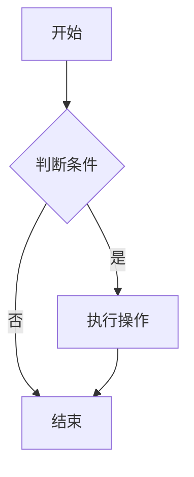
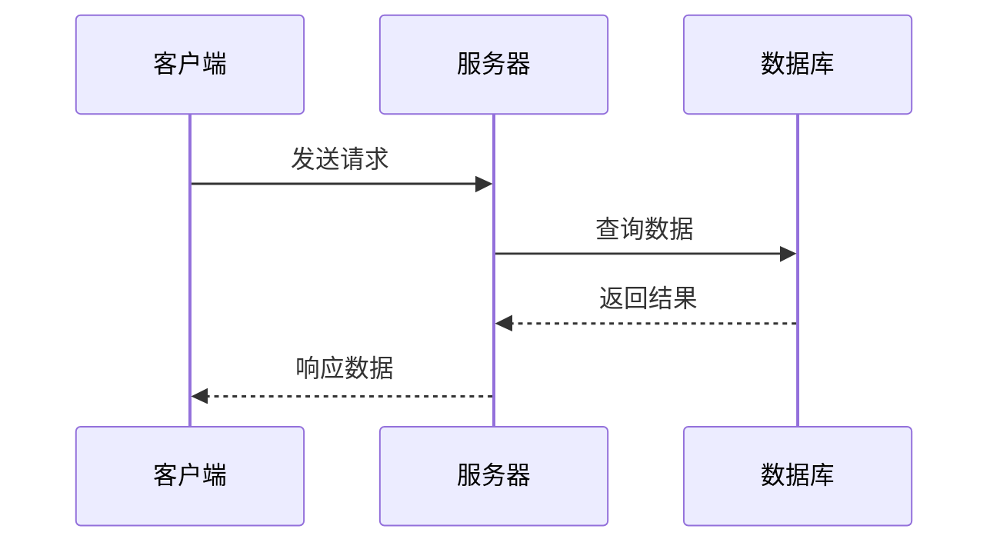
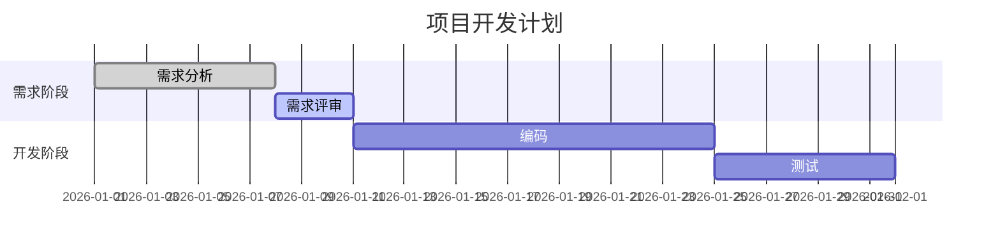
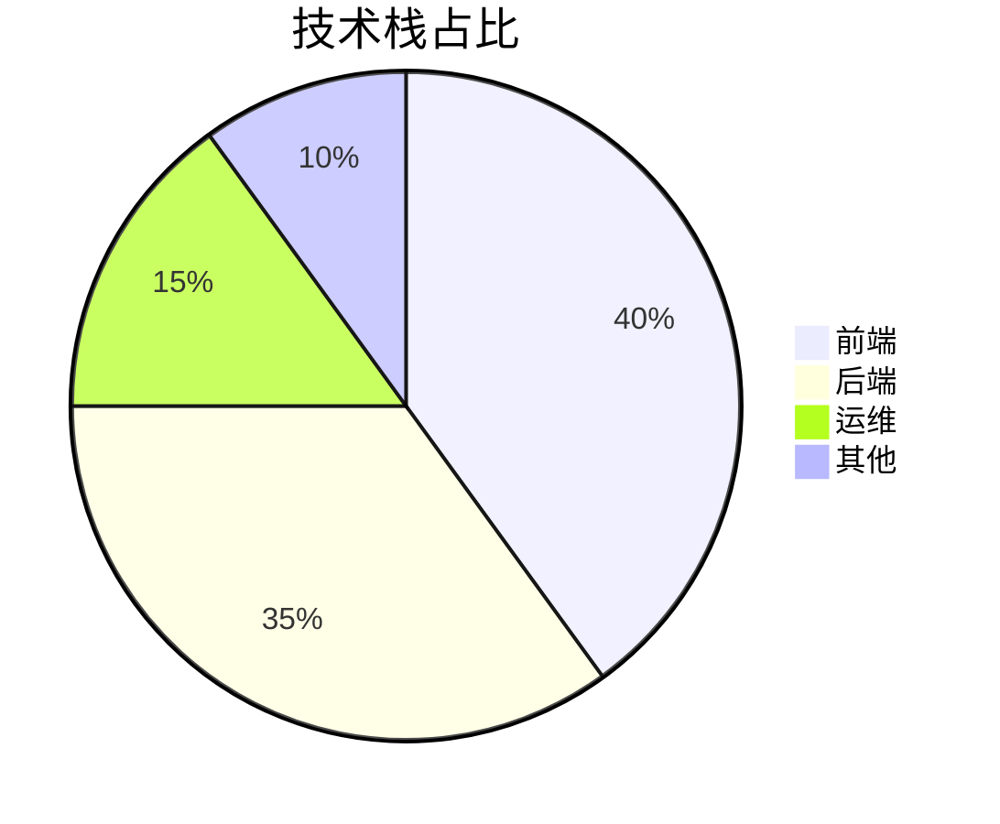
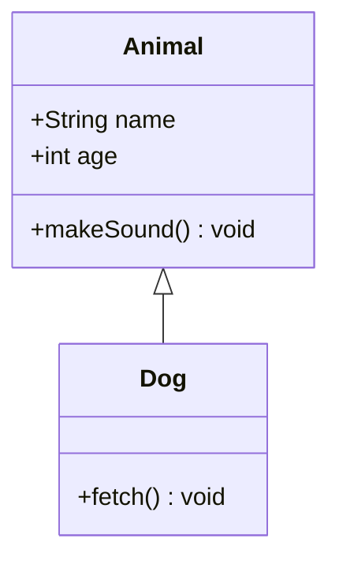

# Markdown 语法指南

> 基于 [菜鸟教程 Markdown 系列](https://www.runoob.com/markdown/md-tutorial.html) 整理，涵盖基础语法到高级技巧，可作为速查手册使用。
>
> 标注说明：🔵 标准语法 &nbsp;&nbsp;🟠 扩展语法（部分编辑器不支持）

---

## 目录

- [1. Markdown 简介](#1-markdown-简介)
- [2. 快速上手](#2-快速上手)
- [3. 基础语法](#3-基础语法)
- [4. 列表](#4-列表)
- [5. 引用块](#5-引用块)
- [6. 链接](#6-链接)
- [7. 图片](#7-图片)
- [8. 代码](#8-代码)
- [9. 表格](#9-表格)
- [10. 高级技巧](#10-高级技巧)
- [附录 A：常用编辑器对比](#附录-a常用编辑器对比)
- [附录 B：语言标识符速查表](#附录-b语言标识符速查表)
- [附录 C：特殊符号转义表](#附录-c特殊符号转义表)
- [附录 D：技术文档通用模板](#附录-d技术文档通用模板)

---

## 1. Markdown 简介

**Markdown** 是一种轻量级标记语言，由 John Gruber 于 2004 年创建。它使用纯文本编写，通过简单的符号标记实现排版，最终可转换为 HTML、PDF 等多种格式。

### 优点

- 纯文本，任何编辑器都能打开
- 语法简洁，学习成本低
- 专注于内容而非排版
- 版本管理友好（Git 可清晰追踪变更）
- 广泛用于技术文档、博客、README、笔记等

### 文件扩展名

`.md` 或 `.markdown`

---

## 2. 快速上手

### 2.1 第一个 Markdown 文件

用任意文本编辑器新建文件 `hello.md`，写入以下内容：

```markdown
# 我的第一篇 Markdown

Hello, **Markdown**!

- 第一条
- 第二条
- 第三条

[点这里访问 GitHub](https://github.com)
```

保存后用支持 Markdown 预览的编辑器打开即可看到渲染效果。

### 2.2 推荐编辑器

| 编辑器 | 特点 | 推荐场景 |
|--------|------|----------|
| **VS Code** + Markdown Preview Enhanced 插件 | 免费、功能强、生态好 | ⭐ 首选推荐 |
| **Typora** | 所见即所得，颜值高 | 写作/笔记 |
| **Obsidian** | 双向链接、图谱视图 | 知识管理 |
| **MarkText** | 开源、简洁 | 轻量替代 |
| **在线编辑器**（如 StackEdit、Dillinger） | 免安装 | 临时使用 |

---

## 3. 基础语法

### 3.1 标题 🔵

使用 `#` 号，共六级标题：

```markdown
# 一级标题
## 二级标题
### 三级标题
#### 四级标题
##### 五级标题
###### 六级标题
```

> 💡 **建议**：`#` 后加一个空格再写文字，这是最通用的写法。一级标题通常一个文档只用一次。

---

### 3.2 段落与换行 🔵

```markdown
段落之间用空行分隔。

这是新的一段。

同一段内换行，在行末加两个空格再回车  
这行就另起一行了。（上面行末有两个空格）
```

> 💡 **推荐**：不同编辑器对换行处理不一致，最稳妥的方式是用空行区分段落。

---

### 3.3 字体样式

> 包含 🔵 标准语法、🟠 扩展语法和 HTML 标签。

| 效果 | 语法 | 说明 |
|------|------|------|
| *斜体* | `*斜体*` 或 `_斜体_` | 🔵 |
| **粗体** | `**粗体**` 或 `__粗体__` | 🔵 |
| ***粗斜体*** | `***粗斜体***` | 🔵 |
| ~~删除线~~ | `~~删除线~~` | 🟠 扩展语法 |
| <u>下划线</u> | `<u>下划线</u>` | HTML 标签 |

---

### 3.4 分割线 🔵

三个或以上的 `*`、`-` 或 `_` 单独成行：

```markdown
---
***
___
```

效果相同，都渲染为一条水平线：

---

> 💡 **建议**：用 `---` 最通用，前后留空行避免被误解析为标题。

---

### 3.5 注释

Markdown 原生不支持注释，可用 HTML 注释：

```markdown
<!-- 这是注释，渲染时不可见 -->
```

---

## 4. 列表

### 4.1 无序列表 🔵

使用 `*`、`+` 或 `-` 作为标记：

```markdown
- 第一项
- 第二项
- 第三项
```

效果：
- 第一项
- 第二项
- 第三项

> 💡 **建议**：统一用 `-`，混用不同符号虽然合法但影响可读性。

---

### 4.2 有序列表 🔵

数字 + `.` + 空格：

```markdown
1. 第一项
2. 第二项
3. 第三项
```

效果：
1. 第一项
2. 第二项
3. 第三项

> 💡 实际上数字可以不连续——渲染器会自动递增。但建议写对数字，保证源码可读性。

---

### 4.3 嵌套列表 🔵

子列表前加 **4 个空格** 或 **1 个 Tab**：

```markdown
1. 水果
    - 苹果
    - 香蕉
2. 蔬菜
    - 青菜
    - 萝卜
```

---

### 4.4 任务列表 🟠

```markdown
- [x] 已完成任务
- [ ] 待办任务
- [ ] 另一件待办
```

效果：
- [x] 已完成任务
- [ ] 待办任务
- [ ] 另一件待办

> 🟠 部分编辑器支持点击切换状态（如 VS Code、GitHub）。

---

## 5. 引用块 🔵

### 5.1 基本引用

```markdown
> 这是一段引用内容
```

效果：
> 这是一段引用内容

---

### 5.2 嵌套引用

```markdown
> 第一层
> > 第二层
> > > 第三层
```

效果：
> 第一层
> > 第二层
> > > 第三层

---

### 5.3 引用中嵌套其他元素

```markdown
> # 引用中的标题
>
> - 引用中的列表
> - 第二项
>
> 引用中也可以放 **粗体** 和 `代码`。
```

效果：
> # 引用中的标题
>
> - 引用中的列表
> - 第二项
>
> 引用中也可以放 **粗体** 和 `代码`。

---

## 6. 链接

### 6.1 行内链接 🔵

```markdown
[链接文字](https://www.example.com)
[链接文字](https://www.example.com "鼠标悬停显示的标题")
```

示例：[Markdown 官方说明](https://daringfireball.net/projects/markdown/ "鼠标悬停可见")

---

### 6.2 自动链接 🔵

用尖括号包裹 URL：

```markdown
<https://www.example.com>
<user@example.com>
```

---

### 6.3 参考式链接 🔵

将 URL 集中放在文档末尾，正文引用变量名：

```markdown
这个链接用 [runoob] 作为网址变量：[菜鸟教程][runoob]

[runoob]: https://www.runoob.com
```

> 💡 适合多处引用同一链接的场景，方便统一修改。

---

### 6.4 锚点链接（页内跳转）

```markdown
跳转到 [基础语法](#3-基础语法)
```

> 锚点 ID 规则：标题文字转为全小写，空格替换为 `-`，去掉标点。

---

## 7. 图片

### 7.1 基本语法 🔵

```markdown


```

```markdown

```

---

### 7.2 图片链接 🔵

将图片语法外包裹一层链接：

```markdown
[](https://www.runoob.com)
```

点击图片时跳转到指定链接。

---

### 7.3 控制图片尺寸与对齐 🔵

Markdown 原生不支持调整图片大小，需使用 HTML `` 标签：

```html
<!-- 控制宽度 -->


<!-- 控制宽高 -->


<!-- 居中 -->
<div align="center">
  
</div>
```

---

### 7.4 图片路径建议

| 路径类型 | 示例 | 说明 |
|----------|------|------|
| 相对路径 | `` | ⭐ 推荐，方便项目迁移 |
| 绝对路径 | `` | 仅限本机 |
| 网络 URL | `` | 依赖网络 |

---

## 8. 代码

### 8.1 行内代码 🔵

用单个反引号包裹：

```markdown
在 C 语言中用 `printf()` 函数输出内容。
```

效果：在 C 语言中用 `printf()` 函数输出内容。

> 💡 代码内容本身含反引号时，用双反引号包裹：`` 这是 ` 一个反引号 ``

---

### 8.2 代码块 🔵

**方式一：围栏式代码块（推荐）**

用三个反引号包裹，可指定语言获得语法高亮：

````markdown
```javascript
function hello() {
    console.log("Hello, Markdown!");
}
```
````

**方式二：缩进式代码块**

每行缩进四个空格或一个 Tab：

```markdown
    function hello() {
        console.log("Hello, Markdown!");
    }
```

> 💡 **建议**：优先使用围栏式，可指定语言获取高亮，也更清晰。

---

### 8.3 Diff 代码块 🟠

展示代码变更差异，用 `diff` 作为语言标识：

````markdown
```diff
 function hello() {
-    console.log("old code");
+    console.log("new code");
 }
```
````

其中 `+` 表示新增行（绿色），`-` 表示删除行（红色）。

---

### 8.4 常用语言标识符

| 语言 | 标识符 | 语言 | 标识符 |
|------|--------|------|--------|
| JavaScript | `js` / `javascript` | TypeScript | `ts` / `typescript` |
| Python | `py` / `python` | Java | `java` |
| C | `c` | C++ | `cpp` / `c++` |
| C# | `cs` / `csharp` | Go | `go` |
| Rust | `rust` | Kotlin | `kotlin` |
| HTML | `html` | CSS | `css` |
| SQL | `sql` | Bash/Shell | `bash` / `sh` |
| JSON | `json` | YAML | `yaml` / `yml` |
| Markdown | `markdown` / `md` | Diff | `diff` |
| Dockerfile | `dockerfile` | Nginx | `nginx` |

> 完整速查表见 [附录 B](#附录-b语言标识符速查表)。

---

## 9. 表格

### 9.1 基本语法 🔵

```markdown
| 表头1 | 表头2 | 表头3 |
|-------|-------|-------|
| 单元格A | 单元格B | 单元格C |
| 单元格D | 单元格E | 单元格F |
```

效果：

| 表头1 | 表头2 | 表头3 |
|-------|-------|-------|
| 单元格A | 单元格B | 单元格C |
| 单元格D | 单元格E | 单元格F |

---

### 9.2 对齐方式 🔵

```markdown
| 左对齐 | 居中对齐 | 右对齐 |
|:-------|:--------:|-------:|
| 内容 | 内容 | 内容 |
```

| 语法 | 含义 |
|------|------|
| `:---` | 左对齐（默认） |
| `:---:` | 居中对齐 |
| `---:` | 右对齐 |

---

### 9.3 表格内嵌格式

单元格中可使用行内 Markdown 语法：

```markdown
| 名称 | 状态 | 操作 |
|------|------|------|
| 项目A | ✅ 已完成 | [查看](#) |
| 项目B | ⏳ **进行中** | `待发布` |
```

---

### 9.4 注意事项

- 管道符 `|` 两端的空格仅影响源码美观，不影响渲染
- 两端的竖线 `|` 并非必须，但建议保留以增强可读性
- 表格前后建议留空行，避免部分解析器出错
- 复杂表格（合并单元格等）需使用 HTML `<table>` 标签

---

## 10. 高级技巧

### 10.1 支持的 HTML 元素

Markdown 中可直接使用大部分行内 HTML 标签：

| 标签 | 效果 | 说明 |
|------|------|------|
| `<b>粗体</b>` | <b>粗体</b> | 等同于 `**粗体**` |
| `<i>斜体</i>` | <i>斜体</i> | 等同于 `*斜体*` |
| `<kbd>Ctrl</kbd> + <kbd>C</kbd>` | <kbd>Ctrl</kbd> + <kbd>C</kbd> | 键盘按键样式 |
| `<sup>上标</sup>` | x<sup>2</sup> | 上标 |
| `<sub>下标</sub>` | H<sub>2</sub>O | 下标 |
| `<mark>高亮</mark>` | <mark>高亮</mark> | 高亮标记 |
| `<br>` | 强制换行 | 等同于行末两空格 |

```markdown
这是<b>粗体</b>，这是<i>斜体</i>
请按下 <kbd>Ctrl</kbd> + <kbd>S</kbd> 保存
水的分子式：H<sub>2</sub>O
面积单位：m<sup>2</sup>
```

> ⚠️ HTML 块级标签（如 `<div>`、`<table>`）内部不支持 Markdown 语法，需全部使用 HTML 编写。

---

### 10.2 转义字符 🔵

Markdown 使用反斜杠 `\` 转义特殊符号：

```markdown
\*  星号
\_  下划线
\#  井号
\+  加号
\-  减号
\.  句号
\!  感叹号
\{  左花括号
\}  右花括号
\[  左方括号
\]  右方括号
\(  左圆括号
\)  右圆括号
\`  反引号
\|  管道符
```

示例：`\*不是斜体\*` → \*不是斜体\*

---

### 10.3 Mermaid 图表 🟠

Mermaid 是一种用纯文本绘制图表的语法，广泛支持于 GitHub、GitLab、VS Code 等平台。

#### 流程图（Flowchart）

````markdown

````

**方向关键词：**

| 关键词 | 方向 | 关键词 | 方向 |
|--------|------|--------|------|
| `TB` / `TD` | 从上到下 | `BT` | 从下到上 |
| `LR` | 从左到右 | `RL` | 从右到左 |

**形状速查：**

| 语法 | 形状 |
|------|------|
| `A[矩形]` | 矩形 |
| `A(圆角矩形)` | 圆角矩形 |
| `A{菱形}` | 菱形（判断） |
| `A((圆形))` | 圆形 |
| `A>不对称]` | 旗帜 |
| `A[[子程序]]` | 子程序 |

---

#### 时序图（Sequence Diagram）

````markdown

````

---

#### 甘特图（Gantt Chart）

````markdown

````

---

#### 饼图（Pie Chart）

````markdown

````

---

#### 类图（Class Diagram）

````markdown

````

---

### 10.4 数学公式（LaTeX）🟠

使用 `$...$` 写行内公式，`$$...$$` 写块级公式。

#### 行内公式

```markdown
质能方程：$E = mc^2$
```

效果：质能方程：$E = mc^2$

#### 块级公式

```markdown
$$
\int_{-\infty}^{\infty} e^{-x^2} \, dx = \sqrt{\pi}
$$
```

$$ \int_{-\infty}^{\infty} e^{-x^2} \, dx = \sqrt{\pi} $$

#### 常用符号速查

| 描述 | 语法 | 效果 |
|------|------|------|
| 上标 | `x^{2}` | $x^{2}$ |
| 下标 | `x_{1}` | $x_{1}$ |
| 分数 | `\frac{a}{b}` | $\frac{a}{b}$ |
| 根号 | `\sqrt{x}` | $\sqrt{x}$ |
| 求和 | `\sum_{i=1}^{n}` | $\sum_{i=1}^{n}$ |
| 积分 | `\int_{a}^{b}` | $\int_{a}^{b}$ |
| 极限 | `\lim_{x \to \infty}` | $\lim_{x \to \infty}$ |
| 希腊字母 | `\alpha \beta \gamma \delta` | $\alpha \beta \gamma \delta$ |
| 乘号 | `\times` | $\times$ |
| 点乘 | `\cdot` | $\cdot$ |
| 不等号 | `\neq` | $\neq$ |
| 大于等于 | `\geq` | $\geq$ |
| 小于等于 | `\leq` | $\leq$ |
| 约等于 | `\approx` | $\approx$ |

> ⚠️ 需要编辑器/平台支持 MathJax 或 KaTeX 渲染引擎。GitHub、VS Code（装插件）、Typora 均支持。

---

### 10.5 脚注 🟠

```markdown
这是一段需要注释的文字[^1]。

[^1]: 这是脚注的具体说明内容。
```

效果：正文中出现可点击的上标标记，点击后跳转到页面底部的注释。

> 🟠 并非所有平台都支持（GitHub 支持，VS Code 需插件）。

---

### 10.6 高亮文本 🟠

```markdown
需要重点==强调==的内容
```

效果：需要重点==强调==的内容

> 🟠 部分编辑器支持（Typora、Obsidian；标准 CommonMark 不支持）。

---

### 10.7 Emoji 表情 🟠

```markdown
:smile:  :heart:  :thumbsup:  :rocket:
```

> 支持 Emoji 短码的平台会自动转换为 😄 ❤️ 👍 🚀。GitHub、VS Code 均支持。

---

### 10.8 YAML Front Matter 🟠

在 Markdown 文件最顶端使用 `---` 包裹 YAML 元数据：

```markdown
---
title: 我的文档标题
author: 张三
date: 2026-07-06
tags: [教程, 技术]
---

# 正文开始
...
```

> 常用于静态网站生成器（Hexo、Jekyll、Hugo）和 Obsidian 等工具。

---

## 附录 A：常用编辑器对比

| 编辑器 | 价格 | 平台 | 特点 | 适用场景 |
|--------|------|------|------|----------|
| VS Code + Markdown Preview Enhanced | 免费 | Win/Mac/Linux | 插件生态强、Git 集成、自定义程度高 | ⭐ 开发者首选 |
| Typora | 付费 | Win/Mac/Linux | 所见即所得、主题美观、导出格式多 | 写作/笔记 |
| Obsidian | 免费 | Win/Mac/Linux/移动端 | 双向链接、知识图谱、插件丰富 | 知识管理 |
| MarkText | 免费开源 | Win/Mac/Linux | 简洁、所见即所得、无注册 | 轻量替代 |
| Notion | 免费增值 | Web/Win/Mac/移动端 | 全能型、协作强 | 团队协作 |
| 有道云笔记 | 免费 | Win/Mac/移动端 | 国内同步好 | 国内用户 |
| StackEdit | 免费 | Web | 在线、免安装 | 临时编辑 |

---

## 附录 B：语言标识符速查表

### 编程语言

| 语言 | 标识符 | 别名 |
|------|--------|------|
| JavaScript | `javascript` | `js` |
| TypeScript | `typescript` | `ts` |
| Python | `python` | `py` |
| Java | `java` | — |
| C | `c` | — |
| C++ | `cpp` | `c++` |
| C# | `csharp` | `cs` |
| Go | `go` | `golang` |
| Rust | `rust` | — |
| Kotlin | `kotlin` | — |
| Swift | `swift` | — |
| Ruby | `ruby` | `rb` |
| PHP | `php` | — |
| R | `r` | — |
| Dart | `dart` | — |
| Scala | `scala` | — |

### 标记 / 配置 / 数据格式

| 语言 | 标识符 | 别名 |
|------|--------|------|
| HTML | `html` | — |
| CSS | `css` | — |
| SCSS/Sass | `scss` / `sass` | — |
| JSON | `json` | — |
| YAML | `yaml` | `yml` |
| XML | `xml` | — |
| TOML | `toml` | — |
| INI | `ini` | — |

### 数据库

| 数据库 | 标识符 |
|--------|--------|
| SQL | `sql` |
| MySQL | `mysql` |
| PostgreSQL | `postgresql` / `pgsql` |

### Shell / 脚本

| 类型 | 标识符 | 别名 |
|------|--------|------|
| Bash | `bash` | `sh` |
| PowerShell | `powershell` | `pwsh` |
| Batch (Windows) | `batch` | `bat` / `cmd` |

### 其他

| 类型 | 标识符 |
|------|--------|
| Dockerfile | `dockerfile` / `docker` |
| Nginx 配置 | `nginx` |
| Makefile | `makefile` / `make` |
| Diff | `diff` |
| 纯文本 | `text` / `plaintext` |
| 无高亮 | 不写或 ` `（留空） |
| Graphviz | `dot` |

---

## 附录 C：特殊符号转义表

需要输出这些符号本身时，前面加 `\`：

| 符号 | 名称 | 转义写法 | 说明 |
|------|------|----------|------|
| `*` | 星号 | `\*` | 标记斜体/粗体 |
| `_` | 下划线 | `\_` | 标记斜体/粗体/分割线 |
| `#` | 井号 | `\#` | 标记标题 |
| `` ` `` | 反引号 | `` \` `` | 标记行内代码 |
| `[` | 左方括号 | `\[` | 标记链接/图片 |
| `]` | 右方括号 | `\]` | 标记链接/图片 |
| `(` | 左圆括号 | `\(` | 标记链接/图片 |
| `)` | 右圆括号 | `\)` | 标记链接/图片 |
| `{` | 左花括号 | `\{` | 部分扩展语法 |
| `}` | 右花括号 | `\}` | 部分扩展语法 |
| `.` | 句号 | `\.` | 被误解析为有序列表 |
| `!` | 感叹号 | `\!` | 标记图片 |
| `|` | 管道符 | `\|` | 表格分隔符 |
| `<` | 小于号 | `\<` | HTML 标签 |
| `>` | 大于号 | `\>` | 引用块/HTML 标签 |
| `-` | 减号 | `\-` | 无序列表/分割线 |
| `+` | 加号 | `\+` | 无序列表 |
| `~` | 波浪号 | `\~` | 删除线（扩展） |

---

## 附录 D：技术文档通用模板

以下是一份骨架模板，适用于项目 README、方案设计、API 文档等场景，`[...]` 替换为实际内容即可。

````markdown
# [项目名称]

> [一句话说清这个项目做什么]

## 背景

[为什么要做，解决什么问题]

## 快速开始

```bash
git clone [repo-url] && cd [project]
[install-command]
[start-command]
```

## 目录结构

```
[project]/
├── src/          # [说明]
├── tests/        # [说明]
├── docs/         # [说明]
└── README.md
```

## API 概览

| 方法 | 路径 | 说明 |
|------|------|------|
| GET | `/api/v1/[resource]` | [说明] |
| POST | `/api/v1/[resource]` | [说明] |

### 示例

```
GET /api/v1/[resource]
```

响应：

```json
{
  "code": 0,
  "data": {}
}
```

## 配置

| 变量 | 说明 | 默认值 |
|------|------|--------|
| `[KEY]` | [说明] | [默认值] |

## 部署

```bash
[docker-build-command]
[docker-run-command]
```

## 常见问题

<details>
<summary>[问题描述]</summary>

[解答]

</details>

## 更新日志

- **[版本号]** (日期) — [变更摘要]

## 许可证

[LICENSE] © [年份] [作者]
````

---

> 📚 **参考来源**：[菜鸟教程 Markdown 系列](https://www.runoob.com/markdown/md-tutorial.html)
>
> 🕒 **整理日期**：2026-07-06
